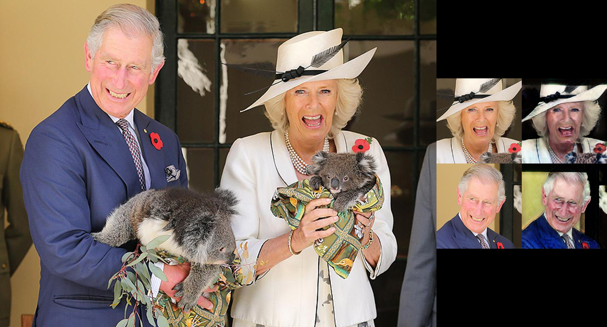

# CUT Implementation for Face Extraction and Portrait Generation
This repository uses [Yolo-V5](https://github.com/ultralytics/yolov5) and [CUT](https://github.com/taesungp/contrastive-unpaired-translation) to detect faces in an image and then convert them into portraits (see the [architecture](#Architecture) for more info on how it works). To see how to use the code, check out the [usage](#usage) section for more information.
## Example
This is an example of what the model can do:

## Setup
### pip
Tested on Python 3.6
```pip install -r requirements.txt```
### conda
`conda env create -f environment.yml`
## Usage
```
usage: main.py [-h] [--verbose] [--gpu-ids GPU_IDS [GPU_IDS ...]]
               [--min-face-size MIN_FACE_SIZE]
               {image,folder} ...

Face Extractor and Portrait Generator

positional arguments:
  {image,folder}

optional arguments:
  -h, --help            show this help message and exit
  --verbose, -v         print extra messages
  --gpu-ids GPU_IDS [GPU_IDS ...], --gpus GPU_IDS [GPU_IDS ...]
                        GPUs to run on
  --min-face-size MIN_FACE_SIZE, -s MIN_FACE_SIZE
                        minimum width of detected face (px)
```
### Single Image Conversion
```
usage: main.py image [-h] --input-image INPUT_IMAGE [--save-path SAVE_PATH]

optional arguments:
  -h, --help            show this help message and exit
  --input-image INPUT_IMAGE, --input INPUT_IMAGE, -i INPUT_IMAGE
                        input image location
  --save-path SAVE_PATH, --output SAVE_PATH, -o SAVE_PATH
                        output save location
```
### Folder Conversion
```
usage: main.py folder [-h] --input-folder INPUT_FOLDER
                      [--output-folder OUTPUT_FOLDER]
                      [--extensions EXTENSIONS [EXTENSIONS ...]]

optional arguments:
  -h, --help            show this help message and exit
  --input-folder INPUT_FOLDER, --input INPUT_FOLDER, -i INPUT_FOLDER
                        input image location
  --output-folder OUTPUT_FOLDER, --output OUTPUT_FOLDER, -o OUTPUT_FOLDER
                        output save location
  --extensions EXTENSIONS [EXTENSIONS ...], -e EXTENSIONS [EXTENSIONS ...]
                        image file extensions
```
## Architecture
There are two parts to this code: face extraction and conversion to a painting.
### Image Conversion
This repository is a fork of [taesungp/contrastive-unpaired-translation](https://github.com/taesungp/contrastive-unpaired-translation) because I have trained their model for this task. Read [here](https://taesung.me/ContrastiveUnpairedTranslation/) for more information on Contrastive Unpaired Translation. The real faces in this image are a subset of the [CelebA-HQ Dataset](http://mmlab.ie.cuhk.edu.hk/projects/CelebA.html). That have been further aligned and cropped.
## Face Extrcation
I have reused the code from my emotion detection project, which you can view [here](https://github.com/George-Ogden/emotion). It uses [ultralytics/Yolo-V5](https://github.com/ultralytics/yolov5) under the hood and you can see the finer details [here](https://github.com/George-Ogden/emotion#face-detection).